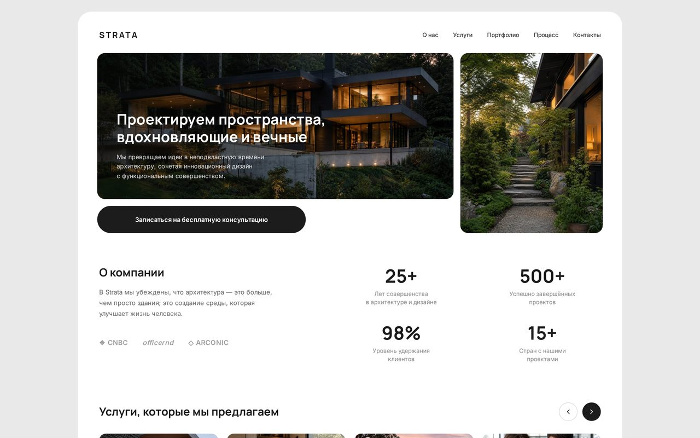

# STRATA — лендинг архитектурного бюро

> Премиальный лендинг архбюро: светлая палитра, воздух, воронка к консультации.

**Демо** · https://apex-arc-theta.vercel.app  **·  Стек** · HTML/CSS Grid + JS

С первого экрана сайт продаёт ощущение премиальной студии. Полноэкранный hero с фото современного дома, заголовок и кнопка-пилюля посажены внизу слева — взгляд скользит по фото прямо к «Записаться на консультацию». Светлая палитра, много воздуха и крупная типографика Manrope — визуальный язык, который считывает аудитория с бюджетом на дом или интерьер.

Дальше страница ведёт клиента по воронке: цифры доверия (годы, проекты, удержание клиентов) → четыре услуги крупными карточками с фото → портфолио реальных типов объектов (дом, отель, офис, ресторан) → отзывы, которые закрывают возражение «а вы справитесь?». Блоки мягко выезжают при скролле, без лишнего движения — дорого значит сдержанно.

Контакт сделан в один шаг: кнопка в подвале ведёт в Telegram (@Frilste), отдельной формы и бэкенда нет — заявка уходит прямиком в личку.

**Под капотом** — чистый CSS Grid и лёгкие анимации появления: быстро грузится и выглядит дорого на любом экране.
